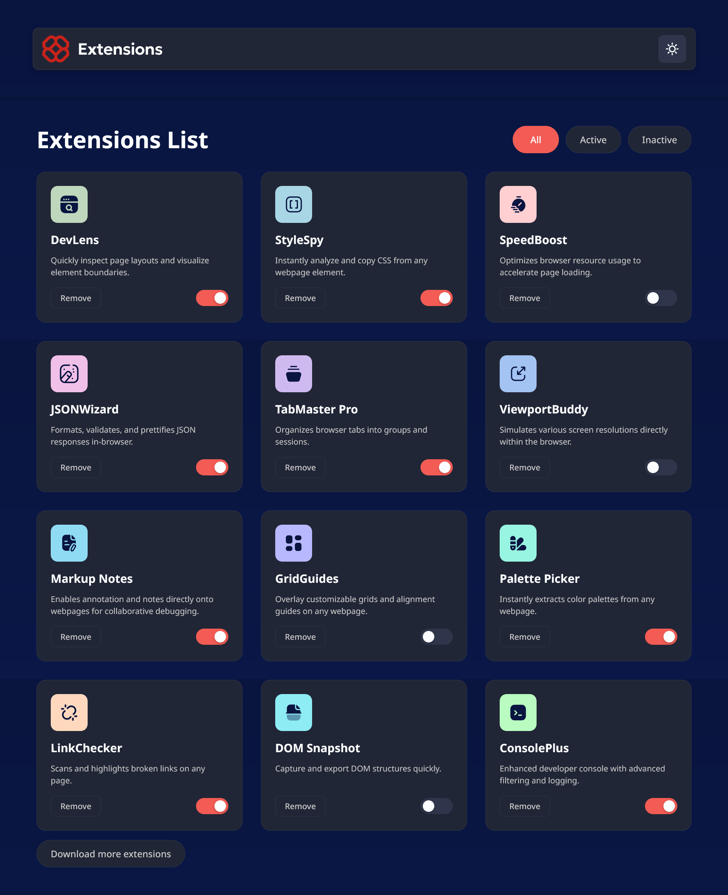
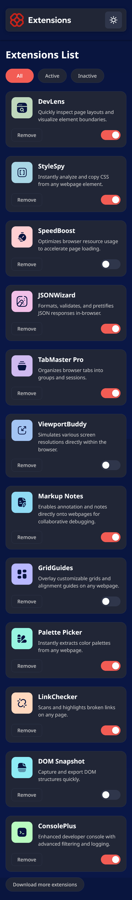

# Frontend Mentor - Browser Extensions Manager solution

This is a solution to the [Browser Extensions Manager challenge](https://www.frontendmentor.io). Frontend Mentor challenges help you improve your coding skills by building realistic projects.

## Table of contents

- [Overview](#overview)
  - [The challenge](#the-challenge)
  - [Screenshot](#screenshot)
  - [Links](#links)
- [My process](#my-process)
  - [Built with](#built-with)
  - [What I learned](#what-i-learned)
  - [Continued development](#continued-development)
  - [Useful resources](#useful-resources)
- [Features](#features)
- [Features in Detail](#features-in-detail)
- [Getting Started](#getting-started)
- [Usage](#usage)
- [Project Structure](#project-structure)
- [Author](#author)
- [Acknowledgments](#acknowledgments)

## Overview

A modern, responsive Extensions Manager built with React that lists developer extensions with filtering, activation toggles, soft-delete/restore, and the ability to add more. Includes a theme toggle and subtle, accessible animations.

### The challenge

Problem: Managing a growing list of tools needs clear filtering, safe removal, and quick recovery.
Solution: Provide All/Active/Inactive filters, a Deleted view for safe restore, an Undo toast, and a simple “Download more extensions” flow.
Impact: A production-friendly pattern for managing lists with optimistic UI and persistence.

### Screenshot




### Links

- Solution URL: [Add solution URL here](https://github.com/your-user/your-repo)
- Live Site URL: [Add live site URL here](https://your-live-site-url.com)

---

## My process

### Overview
Mobile-first component styling with CSS custom properties and a small set of reusable components (cards, filters, modals, toast). State and persistence handled in `App.jsx` with localStorage.

### 1. Planning & Design

- Defined data model for extensions: `{ id, name, description, active, deleted }`.
- Mapped flows for toggle, remove → confirm → undo, restore, and add.
- Matched header pill alignment and focus/hover styles to design.

### 2. Core Implementation

- Functional components: `Header`, `FilterButtons`, `ExtensionCard`, `ConfirmModal`, `UndoToast`, `AddExtensionModal`.
- Conditional "Deleted" chip is hidden when no items are deleted.
- Fallback logo for unknown extension names.

### 3. Accessibility & UX

- Keyboard focus states and `:focus-visible` outlines.
- ARIA roles for modal and toast; `aria-modal` and labelling.
- Animations respect `prefers-reduced-motion`.

### 4. Testing & Iteration

- Verified across common breakpoints and themes.
- Ensured localStorage sync for theme and extensions.

### Built with

- **React + Vite** – Dev server and build
- **CSS** – Variables, Flexbox/Grid
- **LocalStorage** – Persistence

### What I learned

Implemented a safe, user-friendly delete pattern (soft delete + undo + restore) and conditional filtering UI. Practiced accessible focus handling and subtle motion design.

### Continued development

Potential enhancements: multi-select actions, search, import/export JSON, and icon mapping UI for custom extensions.

### Useful resources

- React Docs – react.dev
- Web.dev – Preferences for reduced motion
- MDN – Dialog and ARIA patterns

## Features

| Feature | Details |
|---|---|
| **Responsive layout** | Mobile-first grid with adaptive spacing |
| **Filtering** | All, Active, Inactive, and Deleted (hidden when empty) |
| **Activation toggle** | Smooth animated toggle switch |
| **Soft delete** | Confirm removal, Undo toast, and Deleted view for Restore |
| **Add more** | Modal to add new extensions (name + description) |
| **Theme toggle** | Light/Dark with persisted preference |
| **Animations** | Cards/filters/modal/toast with reduced-motion support |

## Features in Detail

- **Soft Delete & Restore:** Removing sets `deleted=true`. Items appear under Deleted; click Restore to recover. Undo toast allows instant revert.
- **Conditional Deleted Filter:** The Deleted chip appears only when at least one item is deleted; it hides automatically when empty.
- **Add/Download More:** Opens a modal to append a new extension. Unknown names use a fallback icon.
- **Persistence:** Theme and extensions are stored in localStorage.

## Getting Started

1. Install dependencies
   ```bash
   npm install
   ```
2. Start development server
   ```bash
   npm run dev
   ```
3. Build for production
   ```bash
   npm run build
   ```
4. Preview production build
   ```bash
   npm run preview
   ```

### Scripts

- `npm run dev` – Start the Vite dev server
- `npm run build` – Create an optimized production build in `dist/`
- `npm run preview` – Preview the production build locally

## Usage

- Toggle filters to view All/Active/Inactive/Deleted.
- Use Remove to trigger confirmation; Undo from the toast, or Restore from Deleted.
- Click "Download more extensions" to add a new item.
- Switch themes via the header toggle.

## Project Structure

```
browser-extension-manager/
├── src/
│   ├── components/
│   │   ├── Header.jsx / Header.css
│   │   ├── FilterButtons.jsx / FilterButtons.css
│   │   ├── ExtensionCard.jsx / ExtensionCard.css
│   │   ├── ConfirmModal.jsx / ConfirmModal.css
│   │   ├── UndoToast.jsx / UndoToast.css
│   │   └── AddExtensionModal.jsx / AddExtensionModal.css
│   ├── assets/
│   │   └── images/
│   ├── App.jsx
│   ├── App.css
│   └── index.css
├── index.html
├── package.json
└── README.md
```

## Author

- Frontend Mentor - [@MhistaFortune](https://www.frontendmentor.io/profile/MhistaFortune)
- Twitter/X - [@fortunate_egwu](https://www.twitter.com/fortunate_egwu)

## Acknowledgments

- Challenge concept inspired by Frontend Mentor
- Built with React and Vite
